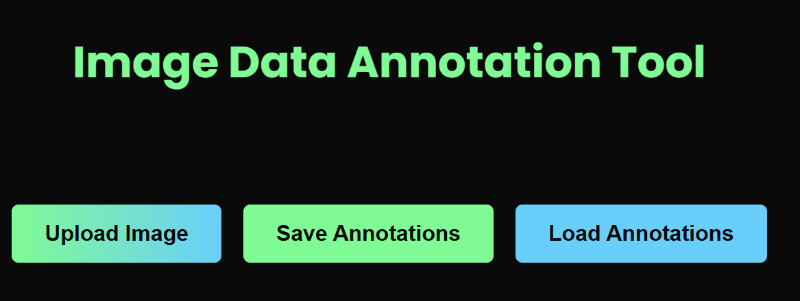

# Robot Data Annotation Tool



The **Robot Data Annotation Tool** is a web-based application built with **React** and **Fabric.js**. It allows users to upload images, annotate them with bounding boxes, and save the annotations in a structured JSON format. This tool is ideal for creating datasets for AI and machine learning projects.

---

## Features

- **Image Upload**: Upload images in PNG or JPEG format.
- **Annotation Drawing**: Draw bounding boxes on the image.
- **Annotation Descriptions**: Add descriptions to each annotation.
- **Save Annotations**: Save annotations as a JSON file.
- **Load Annotations**: Load previously saved annotations from a JSON file.
- **Responsive Design**: Works on both desktop and mobile devices.

---

## Getting Started

Follow these instructions to set up the project locally.

### Prerequisites

- **Node.js**: Make sure you have Node.js installed. Download it from [nodejs.org](https://nodejs.org/).
- **npm**: npm is bundled with Node.js.

### Installation

1. **Clone the repository**:
   ```bash
   git clone https://github.com/AnnieZha99/robot-data-annotation-tool.git
   cd robot-data-annotation-tool
2. **Install dependencies**:
   ```bash
   npm install
3. **Start the development server:**:
   ```bash
   npm start
4. **Open the app:**:

Visit http://localhost:3000 in your browser.

---

## Usage

### Upload an Image
1. Click the **"Upload Image"** button to upload an image from your computer.
2. The image will be displayed on the canvas.

### Draw Annotations
1. Click anywhere on the image to draw a bounding box.
2. Each annotation is automatically numbered.

### Add Descriptions
1. Below the canvas, you’ll see a list of annotations.
2. Enter a description for each annotation in the input field.

### Save Annotations
1. Click the **"Save Annotations"** button to download a JSON file containing the annotations and their descriptions.

### Load Annotations
1. Click the **"Load Annotations"** button to upload a JSON file.
2. The annotations will be displayed on the image.

---

## Folder Structure
```
robot-data-annotation-tool/
├── public/                  # Static files (e.g., default-image.png)
├── src/
│   ├── components/          # React components
│   ├── styles/              # Global styles
│   ├── App.tsx              # Main application component
│   ├── index.tsx            # Entry point
├── package.json             # Project dependencies
├── README.md                # Project documentation

```
---

## Technologies Used

- **React**: A JavaScript library for building user interfaces.
- **TypeScript**: A typed superset of JavaScript.
- **Fabric.js**: A powerful library for working with canvas.
- **Styled Components**: For styling React components.
- **Framer Motion**: For animations.

---

## Acknowledgments

- **Fabric.js** for providing an excellent canvas library.
- **React** and **TypeScript** for making development enjoyable.
- **You** for using this tool! 😊